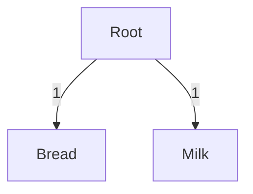
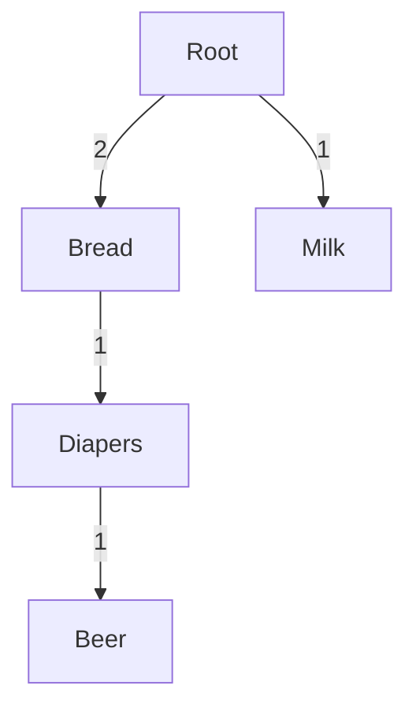
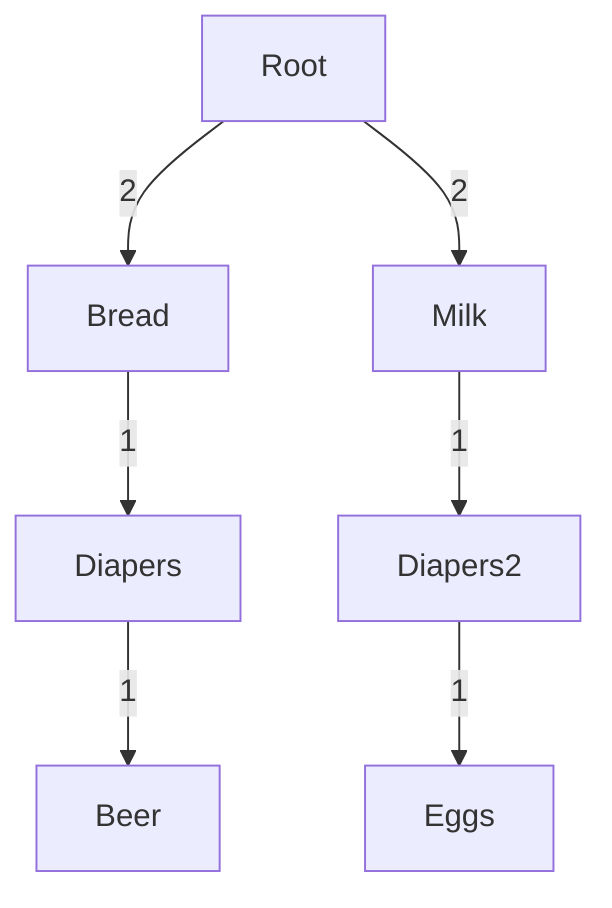
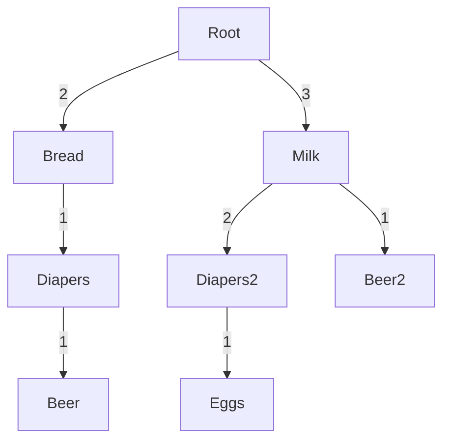
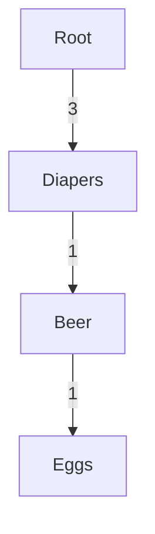

# FP-Growth

The FP-Growth (Frequent Pattern Growth) algorithm is an efficient algorithm for mining frequent itemsets in a transactional database. It uses a compressed data structure called an FP-tree to represent the transactional database and efficiently find frequent itemsets. FP-Growth consists of two main steps: building the FP-tree and mining frequent itemsets from the tree.

### Building the FP-Tree

1. **Create the Header Table:** For each item in the dataset, create an entry in the header table with the item name and a pointer to the first occurrence of that item in the transactions.

2. **Scan the Dataset:** For each transaction in the dataset, sort the items in the transaction based on their frequency in the dataset. Remove items that do not meet the minimum support threshold. Insert the remaining items into the FP-tree, updating the counts of nodes as needed.

3. **Create the FP-Tree:** The FP-tree is constructed recursively by adding each transaction to the tree. If a node with the same item already exists in the current node's children, increment the count of that node. Otherwise, create a new node.

### Mining Frequent Itemsets from the FP-Tree

1. **Generate Conditional Pattern Bases:** For each item in the header table, create a conditional pattern base by tracing back to the root of the FP-tree and collecting the paths to all nodes containing that item.

2. **Build Conditional FP-Trees:** For each conditional pattern base, construct a conditional FP-tree by removing the item and its corresponding nodes from the paths.

3. **Mine Frequent Itemsets:** Recursively mine the conditional FP-trees to find frequent itemsets. Each frequent itemset is formed by combining the item from the header table with the items in the conditional pattern base.

### Example

Let's consider the following dataset:

| Transaction ID | Items Purchased       |
|----------------|-----------------------|
| 1              | Bread, Milk           |
| 2              | Bread, Diapers, Beer  |
| 3              | Milk, Diapers, Eggs   |
| 4              | Milk, Diapers, Beer   |
| 5              | Bread, Milk, Diapers  |

We want to find frequent itemsets with a minimum support of 40% using the FP-Growth algorithm.

```python
from mlxtend.frequent_patterns import fpgrowth
import pandas as pd

# Create a dataframe of transactions
data = {'Transaction ID': [1, 2, 3, 4, 5],
        'Items Purchased': [['Bread', 'Milk'],
                             ['Bread', 'Diapers', 'Beer'],
                             ['Milk', 'Diapers', 'Eggs'],
                             ['Milk', 'Diapers', 'Beer'],
                             ['Bread', 'Milk', 'Diapers']]}
df = pd.DataFrame(data)

# Transform the dataframe into a one-hot encoded format
one_hot_encoded = df['Items Purchased'].str.join('|').str.get_dummies()

# Find frequent itemsets with minimum support of 40%
frequent_itemsets = fpgrowth(one_hot_encoded, min_support=0.4, use_colnames=True)

print("Frequent Itemsets:")
print(frequent_itemsets)
```

This code snippet uses the `fpgrowth` function from the mlxtend library to find frequent itemsets in the dataset. The resulting frequent itemsets are then printed.

let's walk through the FP-Growth algorithm step by step with the provided example dataset to find frequent itemsets with a minimum support of 40%.

### Step 1: Create the Header Table

The header table is used to store the first occurrence of each item in the dataset and link it to the corresponding nodes in the FP-tree.

| Item   | Header Table |
|--------|--------------|
| Bread  | -> Node B    |
| Milk   | -> Node M    |
| Diapers| -> Node D    |
| Beer   | -> Node B    |
| Eggs   | -> Node E    |

### Step 2: Construct the FP-Tree

#### Transaction 1: Bread, Milk

FP-Tree after inserting Transaction 1:





#### Transaction 2: Bread, Diapers, Beer

FP-Tree after inserting Transaction 2:




#### Transaction 3: Milk, Diapers, Eggs

FP-Tree after inserting Transaction 3:



#### Transaction 4: Milk, Diapers, Beer

FP-Tree after inserting Transaction 4:



#### Transaction 5: Bread, Milk, Diapers

FP-Tree after inserting Transaction 5:


### Step 3: Generate Conditional Pattern Bases and Conditional FP-Trees

For each item in the header table, we generate a conditional pattern base and a conditional FP-tree.

For example, for the item Milk:

Conditional Pattern Base:
```
[Diapers]: 3
[Diapers, Eggs]: 1
[Diapers, Beer]: 1
[Diapers, Beer, Eggs]: 1
[Beer]: 1
[Eggs]: 1
```

Conditional FP-Tree:



### Step 4: Mine Frequent Itemsets

We recursively mine the conditional FP-trees to find frequent itemsets. The frequent itemsets found are:

```
[Bread]: 3
[Milk]: 4
[Diapers]: 3
[Diapers, Bread]: 2
[Diapers, Milk]: 3
[Diapers, Bread, Milk]: 2
```

These frequent itemsets satisfy the minimum support threshold of 40%.