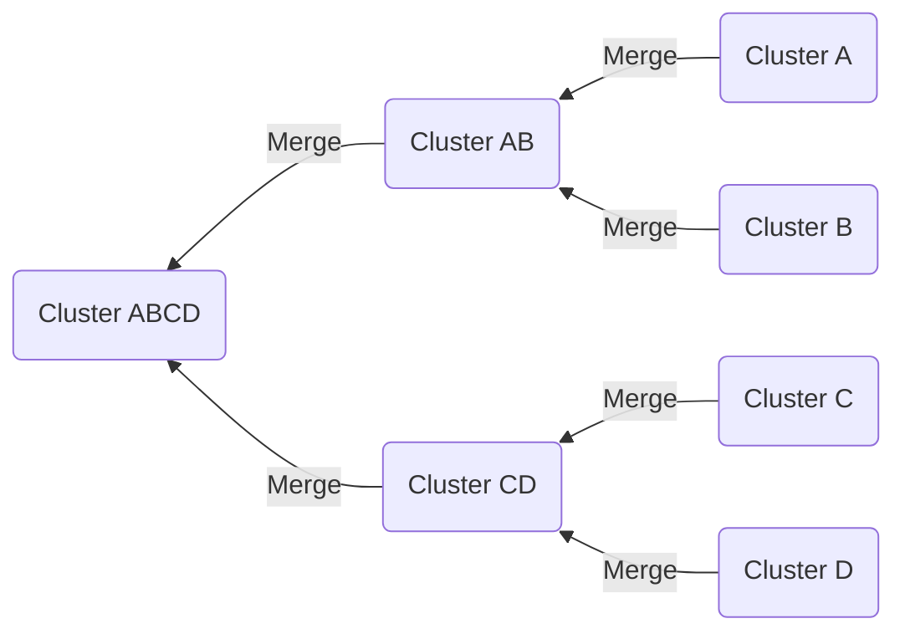
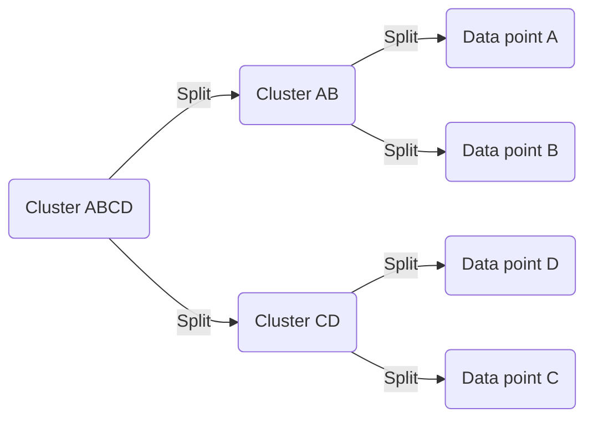

# Hierarchical Methods
### AGNES (AGglomerative NESting)

AGNES is an agglomerative hierarchical clustering algorithm that starts with each data point as a single cluster and iteratively merges the closest clusters until only one cluster remains. It stands for "AGglomerative NESting" because it builds the hierarchy from the bottom up, nesting smaller clusters into larger ones.

#### Algorithm Steps:

1. **Initialization:** Start with $n$ clusters, each containing a single data point.
2. **Calculate Pairwise Distances:** Compute the pairwise distances between all clusters. The distance between clusters can be calculated using various methods, such as single linkage, complete linkage, or average linkage.
3. **Merge Closest Clusters:** Find the two closest clusters based on the chosen distance metric and merge them into a single cluster.
4. **Update Distance Matrix:** Update the distance matrix to reflect the new distances between the merged cluster and the remaining clusters.
5. **Repeat Steps 3 and 4:** Continue merging the closest clusters and updating the distance matrix until only one cluster remains, forming a hierarchy of clusters.

#### Diagram:

In the diagram, each data point (A, B, C, D) starts as a single-cluster, and the algorithm merges the two closest clusters (AB and CD) into a new cluster (ABCD), forming a hierarchical structure.

#### Key Points:
- AGNES is computationally expensive for large datasets due to the need to compute pairwise distances between all clusters at each iteration.
- The choice of distance metric and linkage method can significantly impact the resulting clustering.

AGNES is just one of the hierarchical clustering algorithms, and its approach provides insight into how clusters are merged to form a hierarchy.

### DIANA (DIvisive ANAlysis)

DIANA is a divisive hierarchical clustering algorithm that starts with all data points in a single cluster and recursively splits clusters into smaller clusters until each data point is in its cluster. It stands for "DIvisive ANAlysis" because it divides clusters into smaller clusters.

#### Algorithm Steps:

1. **Initialization:** Start with a single cluster containing all data points.
2. **Calculate Cluster Dissimilarity:** Compute the dissimilarity between all pairs of data points in the cluster.
3. **Split Cluster:** Identify the pair of data points with the highest dissimilarity and split the cluster into two clusters using these points as initial centroids.
4. **Repeat Steps 2 and 3:** Continue splitting clusters recursively until each data point is in its cluster, forming a hierarchy of clusters.

#### Mermaid.js Diagram:

In the diagram, the algorithm starts with a single cluster containing all data points (ABCD) and recursively splits it into two clusters (AB and CD) based on the pair of points with the highest dissimilarity, forming a hierarchical structure.

#### Key Points:
- DIANA is computationally expensive for large datasets due to the need to compute dissimilarities between all pairs of data points in a cluster at each iteration.
- The choice of dissimilarity measure can significantly impact the resulting clustering.

DIANA's approach provides insight into how clusters are recursively split to form a hierarchy, complementing the agglomerative approach of AGNES.

## Measure the distance between two clusters 

When measuring the distance between two clusters in hierarchical clustering, several methods can be used to calculate this distance. Here are some common methods:

### Minimum (Single Linkage) Distance
The minimum distance between two clusters is the shortest distance between any two points in the two clusters. It is also known as the single linkage distance and is calculated as:

$$
d_{\text{min}}(C_i, C_j) = \min_{\mathbf{x} \in C_i, \mathbf{y} \in C_j} d(\mathbf{x}, \mathbf{y})
$$

where $C_i$ and $C_j$ are two clusters, and $d(\mathbf{x}, \mathbf{y})$ is the distance between points $\mathbf{x}$ and $\mathbf{y}$.

### Maximum (Complete Linkage) Distance
The maximum distance between two clusters is the longest distance between any two points in the two clusters. It is also known as the complete linkage distance and is calculated as:

$$
d_{\text{max}}(C_i, C_j) = \max_{\mathbf{x} \in C_i, \mathbf{y} \in C_j} d(\mathbf{x}, \mathbf{y})
$$

### Mean (Average Linkage) Distance
The mean distance between two clusters is the average distance between all pairs of points in the two clusters. It is calculated as:

$$
d_{\text{mean}}(C_i, C_j) = \frac{1}{|C_i| \cdot |C_j|} \sum_{\mathbf{x} \in C_i} \sum_{\mathbf{y} \in C_j} d(\mathbf{x}, \mathbf{y})
$$

### Average Distance
The average distance between two clusters is the average distance between all pairs of points, where one point is from each cluster. It is calculated as:

$$
d_{\text{avg}}(C_i, C_j) = \frac{1}{|C_i| \cdot |C_j|} \sum_{\mathbf{x} \in C_i} \sum_{\mathbf{y} \in C_j} d(\mathbf{x}, \mathbf{y})
$$

where $|C_i|$ and $|C_j|$ are the number of points in clusters $C_i$ and $C_j$, respectively.

These distance measures are used in hierarchical clustering to decide which clusters to merge at each step based on the linkage criterion chosen.