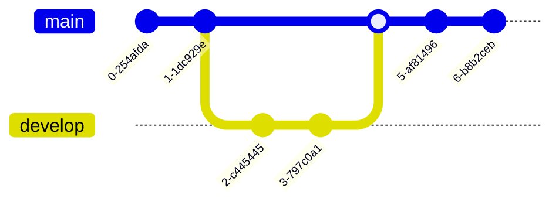

# Git Merge and Resolving Merge Conflicts

Git merge is used to combine changes from different branches into the current branch. However, conflicts can arise when Git cannot automatically merge changes. Here's how to merge branches and resolve conflicts:

## Merge Branches
To merge changes from one branch into another, use the `git merge` command:

1. Switch to the branch you want to merge changes into (e.g., `main`):

   ```bash
   git checkout main
   ```

2. Merge the changes from the other branch (e.g., `feature-x`):

   ```bash
   git merge feature-x
   ```

## Resolving Merge Conflicts
If there are conflicts during the merge process, Git will indicate which files have conflicts. Here's how to resolve them:

1. Open the conflicting file(s) in your code editor. You will see markers indicating the conflicting changes, like `<<<<<<<`, `=======`, and `>>>>>>>`.

2. Edit the file to resolve the conflicts. Decide which changes to keep, modify, or remove.

3. After resolving conflicts, add the modified file(s) to the staging area:

   ```bash
   git add <conflicted_file>
   ```

4. Commit the merge to complete the process:

   ```bash
   git commit
   ```

   Git will automatically create a merge commit with the resolved conflicts.

## Aborting a Merge
If you encounter issues during a merge and want to start over, you can abort the merge using:

```bash
git merge --abort
```

This will reset the merge process and restore the repository to its state before the merge started.

## Summary
- Use `git merge` to combine changes from one branch into another.
- Resolve merge conflicts by editing the conflicting files, adding them to the staging area, and committing the changes.
- Abort a merge using `git merge --abort` if needed.

Merge conflicts are a common occurrence in Git, especially in collaborative projects. Resolving conflicts requires careful examination of the conflicting changes and deciding how to integrate them into the final codebase.

## Grap



