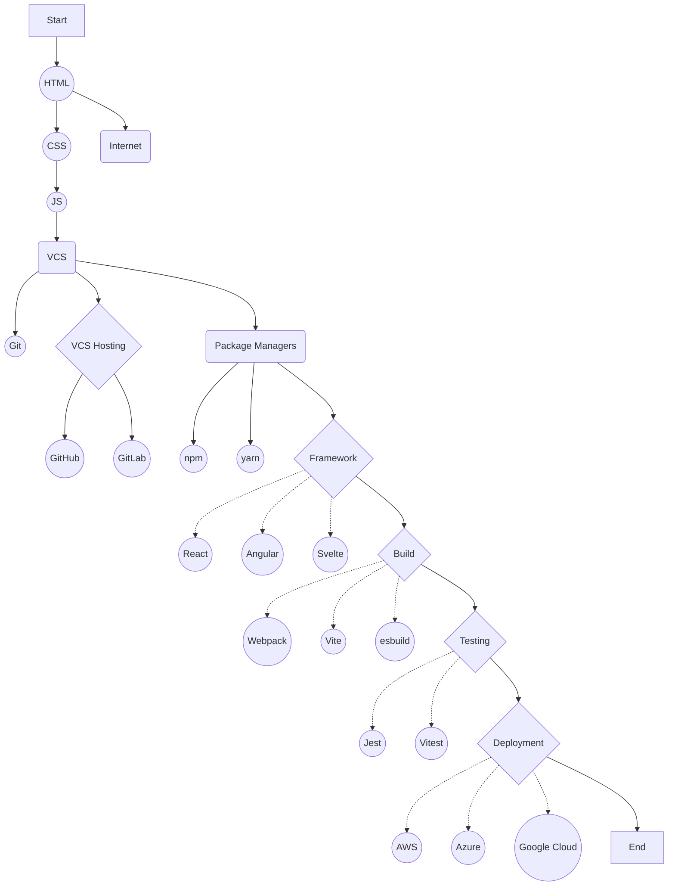

# Web-Development

## Table of Contents

1. [Roadmap](#roadmap)
2. Tools
3. Technologies
4. Frameworks
5. Libraries
id1(Some text)

## Roadmap

for Web Development you need to choose between a few possible paths but all start with the basics:

### Frontend Web Development

1. [HTML](/Programming-Languages/HTML/README.md)
2. [CSS](/Programming-Languages/CSS/README.md)
3. [JavaScript](/Programming-Languages/Javascript/README.md)

After you have a good understanding of the basics you can choose between a few possible paths:

* [React](/Frameworks/React/README.md)
* [Angular](/Frameworks/Angular/README.md)
* [Vue](/Frameworks/Vue/README.md)
* [Svelte](/Frameworks/Svelte/README.md)
* ...

### Backend Web Development

* Node.js
* Express
* ...